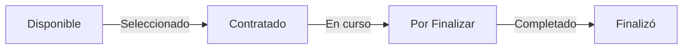

# 📏 Reglas de Negocio - Practicas ITM

## 1. Facultades

### Reglas
- ✅ El nombre de la facultad **debe ser único**
- ✅ Una facultad puede tener **múltiples carreras**
- ✅ Una facultad puede tener **múltiples estudiantes**
- ❌ **No se puede eliminar** una facultad que tenga carreras o estudiantes activos
- ✅ El nombre es **obligatorio** y máximo 255 caracteres

### Flujo
```
Crear Facultad → Agregar Carreras → Asignar Estudiantes
```

---

## 2. Carreras

### Reglas
- ✅ Una carrera **debe pertenecer** a una facultad
- ✅ El nombre de carrera puede repetirse en **diferentes facultades**
- ✅ Una carrera puede tener **múltiples estudiantes**
- ❌ **No se puede eliminar** una carrera con estudiantes activos
- ✅ El nombre es **obligatorio** y máximo 255 caracteres
- ✅ Debe existir la **facultad antes** de crear la carrera

### Validaciones
- Facultad asociada **debe existir** en la BD
- No permitir carreras duplicadas en la misma facultad (opcional)

---

## 3. Estudiantes

### Campos Obligatorios
- ✅ **Número de documento** - Único en el sistema
- ✅ **Nombre** - Máximo 255 caracteres
- ✅ **Apellido** - Máximo 255 caracteres
- ✅ **Email** - Único, formato válido
- ✅ **Género** - (Masculino, Femenino, Otro)
- ✅ **Facultad** - Debe existir
- ✅ **Carrera** - Debe existir en la facultad asignada

### Campos Opcionales
- 📱 Teléfono

### Reglas de Negocio
- ✅ **Documento único** - No puede haber 2 estudiantes con el mismo documento
- ✅ **Email único** - No puede haber 2 estudiantes con el mismo email
- ✅ **Estado por defecto** - Todo estudiante nuevo inicia en "Disponible"
- ✅ **Actualización de datos** - Solo nombre, apellido, email y teléfono
- ✅ **Cambio de estado** - Solo a través del endpoint específico
- ✅ **Carrera asociada** - Debe estar en la facultad asignada

### Estados de Práctica (Semáforo)

```
┌─────────────────────────────────────────────────────────┐
│ 🟢 DISPONIBLE → 🟡 CONTRATADO → 🔴 POR FINALIZAR → ⚫ FINALIZÓ
└─────────────────────────────────────────────────────────┘
```

#### Transiciones Válidas
```
Disponible → Contratado      ✅ Permitido
Contratado → Por Finalizar   ✅ Permitido
Por Finalizar → Finalizó     ✅ Permitido

Disponible → Por Finalizar   ❌ No permitido (falta Contratado)
Finalizó → Disponible        ❌ No permitido (no se revierte)
```

**Nota Importante**: Actualmente el sistema permite transiciones libres. En futuras versiones se implementará validación de transiciones.

---

## 4. Búsquedas y Filtros

### Estudiantes
- **Por documento** - Búsqueda exacta
- **Por email** - Búsqueda exacta
- **Por facultad** - Todos los de esa facultad
- **Por carrera** - Todos los de esa carrera
- **Por estado** - Filtro por estado actual
- **Disponibles** - Shortcut para estado "Disponible"

### Carreras
- **Por facultad** - Todas de esa facultad
- **Todas** - Sin filtros

### Facultades
- **Todas** - Sin filtros de búsqueda

---

## 5. Estadísticas

### Datos Disponibles
Por **Facultad** o **Carrera**:
- Total de estudiantes
- Estudiantes Disponibles
- Estudiantes Contratados
- Estudiantes Por Finalizar
- Estudiantes Finalizó

### Fórmula
```
Total = Disponible + Contratado + Por Finalizar + Finalizó
```

---

## 6. Validaciones de Entrada

### Email
- ✅ Debe contener `@` y punto `.`
- ✅ Máximo 255 caracteres
- ✅ Debe ser único

### Teléfono
- ✅ Solo dígitos (sin espacios ni caracteres especiales)
- ✅ Máximo 20 caracteres
- ✅ Es opcional

### Documento
- ✅ Máximo 50 caracteres
- ✅ Debe ser único
- ✅ Aceptar números y letras

### Nombre/Apellido
- ✅ Máximo 255 caracteres
- ✅ Mínimo 2 caracteres
- ✅ Aceptar letras, espacios y algunos caracteres especiales

---

## 7. Relacionales y Cascadas

### Eliminación en Cascada
```
Facultad → Elimina → Carreras + Estudiantes (con confirmación)
Carrera → Elimina → Estudiantes (con confirmación)
Estudiante → Elimina → Se borra solo
```

### Integridad Referencial
- ❌ No permitir estudiante sin facultad
- ❌ No permitir estudiante sin carrera
- ❌ No permitir carrera sin facultad

---

## 8. Restricciones de Negocio

### Período de Prácticas
- No se define un período máximo en la BD (futuro)
- Puede extenderse indefinidamente

### Cambio de Facultad/Carrera
- ❌ **No permitido** una vez creado el estudiante
- 🔮 Futuro: Permitir con validaciones

### Cambio de Estado
- ✅ Permitido en cualquier momento (sin validación de transición)
- 🔮 Futuro: Validar transiciones válidas

---

## 9. Auditoría (Futuro)

Actualmente se almacenan:
- `fecha_creacion` - Cuando se creó
- `fecha_actualizacion` - Última actualización

En futuras versiones se agregará:
- 🔮 Usuario que realizó cambio
- 🔮 Historial completo de cambios
- 🔮 Razón del cambio

---

## 10. Seguridad Actual y Futura

### Actual
- ✅ Validación de datos en servidor
- ✅ Manejo de errores
- ✅ Integridad referencial en BD

### Futuro
- 🔮 Autenticación JWT
- 🔮 Autorización por roles
- 🔮 Encriptación de datos sensibles
- 🔮 Rate limiting
- 🔮 HTTPS obligatorio

---

## 11. Respuestas de API

### Códigos de Status
| Código | Significado |
|--------|-----------|
| 200 | OK - Solicitud exitosa |
| 201 | Created - Recurso creado |
| 400 | Bad Request - Datos inválidos |
| 404 | Not Found - Recurso no existe |
| 500 | Server Error - Error del servidor |

### Formato de Respuesta

**Exitosa:**
```json
{
  "mensaje": "Descripción del éxito",
  "datos": { /* objeto o array */ }
}
```

**Error:**
```json
{
  "error": "Descripción del error"
}
```

---

## 12. Límites y Cuotas (Futuro)

- 🔮 Máximo de estudiantes por facultad
- 🔮 Máximo de carreras por facultad
- 🔮 Paginación en listados grandes
- 🔮 Caché para búsquedas frecuentes

---

## 13. Conformidad y Estándares

### Cumple con
- ✅ REST API principles
- ✅ HTTP standards
- ✅ JSON format
- ✅ PEP 8 Python style
- ✅ SQLAlchemy best practices

### Base de Datos
- ✅ Relacional (PostgreSQL)
- ✅ Integridad referencial
- ✅ Índices en búsquedas
- ✅ Constraints definidos

---

## 14. Casos de Uso Permitidos

### Caso 1: Flujo Normal de Práctica
```
1. Crear Facultad (Admin)
2. Crear Carrera (Admin)
3. Registrar Estudiante (Admin/Estudiante)
4. Estado: Disponible (automático)
5. Empresa ve disponibles
6. Cambiar a: Contratado (Admin/Empresa)
7. Cambiar a: Por Finalizar (Admin/Empresa)
8. Cambiar a: Finalizó (Admin)
```

### Caso 2: Búsqueda de Candidatos
```
1. Ver estudiantes por facultad
2. Ver estudiantes por carrera
3. Ver estudiantes por estado
4. Ver disponibles específicamente
5. Obtener estadísticas
```

### Caso 3: Administración
```
1. Crear/Editar/Eliminar facultades
2. Crear/Editar/Eliminar carreras
3. Crear/Editar/Eliminar estudiantes
4. Ver reportes y estadísticas
5. Cambiar estados
```

---

## 15. Reglas de Eliminación

### Soft Delete vs Hard Delete
- **Actual**: Hard Delete (elimina completamente)
- 🔮 **Futuro**: Soft Delete (marca como inactivo)

### Permisos de Eliminación
- ❌ **No se puede eliminar** un estudiante con práctica activa
- ✅ **Se puede eliminar** un estudiante disponible
- ❌ **No se puede eliminar** una carrera con estudiantes
- ❌ **No se puede eliminar** una facultad con carreras

---

## Resumen de Transiciones de Estado Válidas



---

**Última actualización**: Marzo 12, 2026  
**Versión**: 1.0.0  
**Próxima revisión**: v2.0.0
